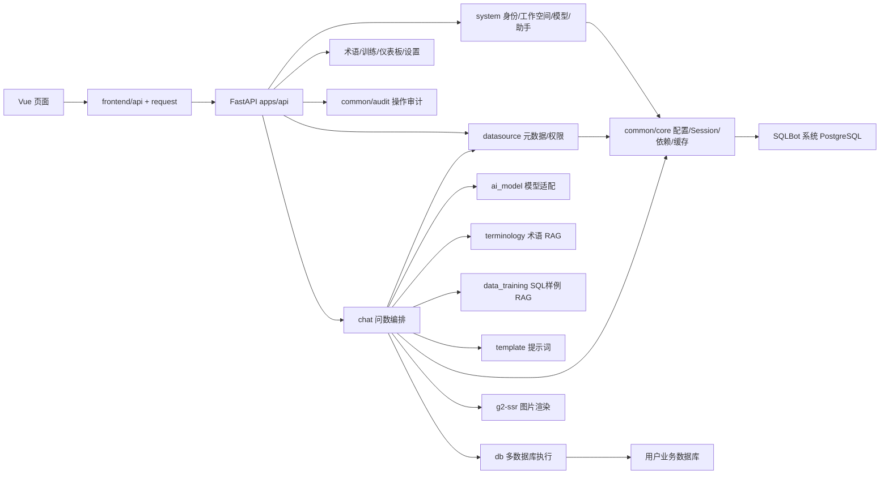

# SQLBot 模块深度导读

这份文档回答的不是“文件在哪里”，而是“每个模块为什么存在、接收什么、处理什么、产出什么，以及它在整条 AI 问数链路中的位置”。阅读具体文件前，先用本篇建立心智模型。

## 1. 一张图看懂模块依赖

最重要的边界：SQLBot 自己的 PostgreSQL 保存配置和问答状态；`apps/db` 连接用户的业务数据库。两者不能混淆。

## 2. 启动与装配模块

### 2.1 `backend/main.py`

**解决的问题**：把分散的路由、中间件、迁移、缓存、RAG 初始化和 MCP 装成可运行服务。

**输入**：根目录 `.env`、系统 PostgreSQL、已有配置数据、磁盘目录。

**过程**：创建 `app` 与 `mcp_app`；lifespan 中运行迁移、初始化缓存和动态 CORS、补齐 embedding、处理模型敏感配置；注册认证、响应、权限与审计中间件；挂载 `/api/v1` 路由。

**输出**：8000 Web/API 服务和 8001 MCP/图片服务。

**关键边界**：启动期任务失败会让整个服务不可用；首次生成 embedding 可能很慢。流式响应不能被统一 JSON 中间件二次包装。

### 2.2 `backend/apps/api.py`

**解决的问题**：为所有业务模块提供唯一的路由汇总点。

它没有业务算法，只做 include_router。新增业务 API 后若忘记在这里注册，代码存在但永远访问不到。

## 3. `system`：身份、租户和 AI 资源控制面

### 3.1 为什么它是控制面

问数流程需要先回答四个问题：当前是谁、属于哪个工作空间、可以用哪个模型、是否处于助手/嵌入场景。`system` 模块保存并解析这些控制信息，本身不负责生成 SQL。

### 3.2 核心对象

- `User`：登录主体、状态、语言、来源、密码。
- `WorkspaceModel`：租户/工作空间边界。
- `UserWsModel`：用户与工作空间关系。
- `AiModelDetail`：供应商、协议、API 地址、Key、基础模型和额外参数。
- `AiModelWorkspaceMapping`：模型在哪些工作空间可用。
- `AssistantModel`：嵌入/高级应用配置、外部数据源协议、UI 和 token。
- `ApiKeyModel`：外部 API 调用凭证。
- `SystemVariable`：可用于行权限表达式的动态值。

### 3.3 关键流程

登录接口验证密码并签发 token；`TokenMiddleware` 每个请求解析普通用户或助手身份；`common/core/deps.py` 再把上下文包装为 `CurrentUser`、`CurrentAssistant`。工作空间切换改变当前 `oid`，后续数据源、术语、训练样例、模型列表都按该 `oid` 隔离。

模型管理 API 负责连通性检查、默认模型和工作空间映射；真正实例化模型由 `ai_model` 完成。助手模块还可以从外部 HTTP API 获取动态数据源和 Schema，通过 `AssistantOutDsFactory` 给问数模块一个统一接口。

### 3.4 输入输出

输入是登录凭据、模型/助手/工作空间配置；输出是请求上下文中的用户、工作空间、助手，以及可供问数选择的模型和数据源范围。

### 3.5 常见坑

- “管理员可见”不等于“当前工作空间用户可用”，模型和数据源都要看映射。
- 模型 API Key 属于敏感字段，不能在日志和普通响应中明文返回。
- 普通用户 token 与助手 token 使用不同 Header；流式 fetch 必须同步认证逻辑。
- 删除工作空间前要考虑用户、模型、数据源、术语和聊天记录的关联。

## 4. `ai_model`：把配置变成统一 LLM

### 4.1 核心作用

屏蔽 OpenAI、Azure、OpenAI-compatible 服务和本地/远程 embedding 的差异，让 chat 只依赖统一的 `BaseChatModel.stream()`。

### 4.2 核心对象

- `LLMConfig`：模型 ID、名称、类型、base model、API 地址/Key、额外参数。
- `BaseLLM`：包装 LangChain BaseChatModel。
- `OpenAILLM`、`OpenAIAzureLLM`、`OpenAIvLLM`：协议实现。
- `LLMFactory`：按 model_type 注册和创建实现。
- `get_default_config`：从系统库选择指定或默认模型，解密并组装配置。

### 4.3 调用关系

`LLMService.create` → `get_default_config` → `LLMFactory.create_llm` → 具体 LangChain ChatModel。SQL、图表、分析、预测都复用同一个实例，但使用不同消息列表。

### 4.4 扩展新供应商

先判断是否 OpenAI-compatible；兼容服务通常只需配置 base URL、model 和 extra params。真正新协议才需要新增 `BaseLLM` 实现并注册工厂，同时补管理界面的 supplier/protocol 配置项、连通性测试和流式 chunk 兼容。

### 4.5 常见坑

- 有些模型把思考内容放在独立字段，有些放在 `<think>`；`process_stream` 需要兼容。
- temperature、max_tokens、enable_thinking 等额外参数不是所有供应商都接受。
- 模型“调用成功”不代表遵循 SQLBot JSON 输出契约，需用实际 Text-to-SQL/Chart prompt 验证。

## 5. `datasource`：业务数据库的元数据控制层

### 5.1 核心作用

保存数据源连接配置，同步表字段，维护表关系、注释、可见性、行列权限和推荐问题，并为 LLM 生成“只包含相关且有权访问内容”的 Schema。

### 5.2 核心对象

- `CoreDatasource`：类型、名称、加密连接配置、工作空间、关系图、embedding。
- `CoreTable`：物理表名、Schema、注释、是否选中、embedding。
- `CoreField`：字段名、类型、业务注释、排序和可见性。
- `DsRules` 等权限对象：行过滤树、列授权和用户/角色范围。

### 5.3 数据源生命周期

创建时先 `check_connection`；保存加密配置；读取远端 Schema；用户选择参与问数的表；同步字段并补充业务注释；保存表关系；异步计算数据源和表 embedding。问数时不再全量扫描远端元数据，而是优先使用已同步、已治理的元数据。

### 5.4 `get_table_schema` 的真实职责

它不只是字符串格式化：先取得当前用户可见表字段；按问题 embedding 选 Top-N 表；把选中表变成 prompt Schema；若关系图关联到未召回表，则补齐关联表；输出 Foreign keys；同时返回允许表名单给 SQL 越权检查。

### 5.5 权限

列权限决定哪些字段能进入 Schema；行权限把前端配置的逻辑树转成 WHERE 条件，支持系统变量/用户绑定变量。`row_permission.py` 必须对值转义、限制逻辑操作符，避免权限配置本身成为 SQL 注入入口。

### 5.6 输入输出

输入是连接配置、用户/工作空间、问题文本和治理元数据；输出是可执行连接、LLM Schema、允许表名单、样例数据与权限过滤条件。

### 5.7 常见坑

- 表/字段注释差会直接降低 Text-to-SQL 准确率。
- 重新同步字段可能影响手工注释和权限映射，应验证保留策略。
- embedding 召回过少会漏表，过多会增加 prompt 噪声。
- Excel 数据源最终也要转换成可查询表，不是让模型直接读 xlsx。

## 6. `db`：多数据库执行与最后一道安全门

### 6.1 核心作用

把 MySQL、PostgreSQL、SQL Server、Oracle、ClickHouse、Doris、StarRocks、Hive、Redshift、Kingbase、达梦、Elasticsearch 等差异统一成连接、元数据读取和 `{fields, data}` 查询结果。

### 6.2 执行流程

`exec_sql` 去掉尾部分号 → `check_sql_read` → 根据 `DB` 选择 SQLAlchemy 或专用驱动 → 执行 → 统一字段名和数据类型 → 返回 fields/data/base64 SQL。

只读检查包含首关键字白名单、危险模式、sqlglot AST 写操作类型和危险函数。默认只允许 SELECT/WITH，元数据语句需显式配置。

### 6.3 为什么仍要只读账号

应用校验是纵深防御的一层，不应替代数据库权限。解析器可能遇到新方言/新函数，生产数据源账号仍应只授予所需 Schema 的 SELECT。

### 6.4 扩展点

新数据库要同步类型枚举、连接参数、驱动依赖、元数据 SQL、sqlglot 方言、危险函数、执行分支和 SQL prompt 方言模板。只加一个 pip 驱动远远不够。

## 7. `terminology`：业务语言 RAG

### 7.1 核心作用

把组织内部词汇和计算口径提供给模型。例如“有效客户”可能意味着 `status='active' AND paid_order_count>0`，这不是表结构本身能表达的知识。

### 7.2 流程

创建/更新术语时生成 embedding 并写 pgvector；问数时按 question embedding 做相似度查询，同时约束工作空间、数据源或高级应用；`get_terminology_template` 把命中项转成 XML 风格上下文交给 prompt。

### 7.3 核心函数

`create_terminology`、`batch_create_terminology`、`save_embeddings`、`select_terminology_by_word`、`get_terminology_template`。

### 7.4 运营建议

术语应写清口径、字段、过滤条件和时间范围，避免只做同义词表。相互矛盾的术语会让模型更不稳定；停用术语不应参与召回。

## 8. `data_training`：SQL few-shot RAG

### 8.1 核心作用

保存经过人工验证的“问题 → SQL”样例，按相似问题召回后放进 Text-to-SQL prompt。它不是训练模型参数，而是运行期 few-shot 示例。

### 8.2 流程

创建/导入样例 → 校验归属和内容 → 生成问题 embedding → 写 pgvector → 问数时 `select_training_by_question` 相似检索 → `get_training_template` 转 XML → `LLMService.init_messages` 加入 prompt。

### 8.3 何时使用

复杂口径、特殊方言函数、多表连接路径和固定业务过滤最适合用 SQL 样例表达。不要保存错误 SQL，也不要为同一问法保存互相矛盾的版本。

### 8.4 与术语的区别

术语回答“业务词是什么意思”；训练样例回答“类似问题应该怎样写 SQL”。两者都会 RAG，但知识粒度不同。

## 9. `template` 与 `backend/templates`：LLM 协议定义

### 9.1 两层结构

`apps/template/*.py` 是读取和分发层；`backend/templates/template.yaml` 是通用 prompt；`sql_examples/*.yaml` 是数据库方言规则和 few-shot 示例。

### 9.2 为什么是协议

Prompt 不仅影响文字风格，还规定模型必须输出哪些 JSON/SQL 标记。解析器 `check_sql`、`check_save_chart` 以及前端图表 schema 都依赖这些格式。修改 prompt 输出结构等同修改接口协议。

### 9.3 SQL prompt 组成

系统身份 → 通用生成规则 → 方言规则/示例 → Schema/样例数据 → 自定义提示词 → 术语 → SQL 训练样例 → 有限轮历史 → 当前问题/错误反馈。

### 9.4 Chart prompt 组成

图表规则 → 用户问题 → 已确认 SQL → 实际使用表 Schema → 建议图表类型。输出应包含 type/title/columns/axis，并且 axis value 必须与查询结果字段一致。

## 10. `chat`：AI 问数状态机

### 10.1 核心作用

把身份、模型、数据源、RAG、prompt、安全校验、数据库执行、持久化和 SSE 串成一轮可观察、可恢复的问答。

### 10.2 核心对象

- `Chat`：会话级上下文和绑定数据源。
- `ChatRecord`：一次问题的持久状态。
- `ChatLog`：每个操作步骤的 prompt、耗时、token 和错误。
- `AiModelQuestion`：给 LLM 使用的本轮上下文。
- `LLMService`：有状态执行器。

### 10.3 生命周期

API 接收问题 → 保存 ChatRecord → RAG → 初始化消息 → 流式 SQL → 解析和权限校验 → 执行并保存数据 → 流式生成 Chart JSON → 保存图表 → finish。每个阶段通过 SSE 更新前端同一条记录。

### 10.4 为什么先落记录

模型或数据库可能在任意阶段失败。先创建 record 后，错误、日志、token、重试和“重新生成”都能锚定到一个 ID；刷新页面也能恢复中间结果。

### 10.5 并发

API 线程调用 `run_task_async`，线程池执行同步 LLM/数据库流程，chunk 暂存在服务对象队列中，`await_result` 持续弹出并写到 StreamingResponse。后台线程使用自己创建的 SQLModel Session，避免跨线程复用请求 Session。

### 10.6 可观测性

`start_log/end_log` 记录选表、术语、样例、生成 SQL、权限 SQL、执行、图表等步骤。前端 ExecutionDetails 将这些日志变成可读执行轨迹，是调试“为什么生成这条 SQL”的首选入口。

## 11. `dashboard`：把一次问数沉淀为长期看板

### 11.1 核心作用

聊天图表是一次性对话结果；仪表板把选中的图表、数据查询、位置、尺寸、样式和文本组件保存成可重复打开的分析页面。

### 11.2 后端对象与流程

API 提供资源树列表、加载、创建/更新/删除、画布创建/更新和名称校验；service 层处理用户/工作空间归属、基础字段和持久化。资源与 canvas 分开，使目录树元数据和大块布局配置可以独立更新。

### 11.3 前端流程

`ChartBlock.addToDashboard` 把问数记录转换为 dashboard view → `AddViewDashboard` 选择目标看板 → Pinia dashboard store 管理画布状态 → `CanvasCore/CanvasShape` 负责拖拽缩放 → editor 保存 → preview 渲染。

### 11.4 常见坑

图表保存的是字段映射和 SQL/数据源引用；若源字段改名、数据源删除或权限变化，旧看板可能失效。画布编辑要考虑快照撤销和组件 ID 唯一性。

## 12. `mcp`：给智能体复用问数能力

### 12.1 核心作用

把“列工作空间/数据源、开始会话、提问、助手提问”暴露为 MCP operation，让 Dify、n8n、MaxKB 或其他客户端调用，而不是模拟浏览器操作。

### 12.2 复用方式

`mcp_question` 和 `mcp_assistant` 复用 `question_answer_inner`，通过 `in_chat=false`、`stream`、`finish_step` 控制输出 SQL、Markdown 数据或图表图片。Web 与 MCP 共享安全校验和 RAG，不维护两套核心逻辑。

### 12.3 图片

需要图片时，后端把图表配置交给 g2-ssr，在 `MCP_IMAGE_PATH` 保存结果，并通过 `SERVER_IMAGE_HOST` 返回外部可访问 URL。该地址不能填写容器内部 localhost。

## 13. `settings` 与 `swagger`

`settings` 当前公开模块较薄，主要提供系统静态/Excel 文件下载 DTO 与接口；动态业务参数主要在 `system/parameter`。不要因目录名误以为所有 `.env` 都能在线修改。

`swagger` 维护 OpenAPI 占位符和中英文翻译；`main.py` 根据 query/header 生成不同语言文档并缓存。新增占位符要同步 zh/en JSON。

## 14. `common/core`：所有模块共享的运行骨架

### 14.1 配置

`Settings` 读取 `.env`，生成系统库 URL、API 前缀和 CORS 列表，控制 embedding、缓存、查询限制、元数据语句、连接池和路径。

### 14.2 系统库 Session

`db.py` 创建 SQLModel engine；`get_session` 在成功时 commit、异常时 rollback、最后 close。API 通过 `SessionDep` 注入。

### 14.3 请求依赖

`deps.py` 从中间件写入的 request.state/context 取得 CurrentUser 和 CurrentAssistant，并按 Accept-Language 提供翻译器。

### 14.4 统一响应与缓存

ResponseMiddleware 统一普通 JSON 协议并处理动态 CORS；exception_handler 把异常转换成稳定错误结构。`sqlbot_cache` 可使用进程内内存或 Redis，多 worker/多实例部署应使用 Redis，否则缓存不共享。

### 14.5 安全

`security.py` 负责密码 hash/token；`SnowflakeBase` 生成大整数 ID。前端必须使用 JSONBig 或字符串，不能直接把 ID 当安全 Number 运算。

## 15. `common/audit`：系统操作审计

### 15.1 与 ChatLog 的区别

审计日志回答“哪个用户调用了哪个管理操作、结果成功还是失败”；ChatLog 回答“模型在这一轮问数内部经历了哪些步骤”。

### 15.2 工作方式

API 上的 `@system_log(LogConfig(...))` 包装同步/异步函数，记录开始时间，从函数参数或返回值表达式提取 resource_id，读取当前用户/IP/User-Agent/请求参数，执行后写成功或失败日志。

### 15.3 常见坑

装饰器顺序会影响它拿到原函数参数和权限结果；敏感字段不能原样进入 operation_detail；新增资源模块要补资源名称解析。

## 16. `common/utils`：跨模块工具箱

这里不是随意堆代码的地方。几个关键工具有明确边界：

- `data_format.py`：数据库值 → JSON/Pandas/Excel，处理大整数和限定列名。
- `embedding_threads.py`：启动期扫描缺失 embedding，并调用各领域保存函数。
- `command_utils.py`：解析聊天快捷命令和 record ID。
- `snowflake.py`：全局 ID。
- `locale.py`：业务 i18n。
- `aes_crypto.py/crypto.py`：数据源与模型敏感配置。
- `utils.py::extract_nested_json`：从模型夹杂解释的文本中提取第一个合法 JSON。

工具函数改动常有大爆炸半径，尤其是 data_format、ID 和加密。

## 17. 数据库迁移、国际化、脚本与测试

`alembic` 管 SQLBot 系统库版本，启动自动 upgrade head。修改 SQLModel 表结构必须新增迁移，并在“已有旧数据”的数据库验证。

`locales` 是运行期业务文案，`swagger/locales` 是接口文档文案，`frontend/src/i18n` 是浏览器 UI 文案，三者职责不同。

`scripts` 封装 prestart、迁移、lint、pytest；`tests` 目前覆盖 SQL 注入转义、Minimax 集成和供应商配置等重点，但 chat 主链路仍值得补 SSE、安全和 prompt 解析测试。

## 18. 前端启动、路由与布局

### 18.1 `main.ts` / `App.vue`

创建 Vue 应用，安装 Pinia、router、i18n 和 UI 插件；App 是根容器。全局样式在 `style.less`。

### 18.2 router

使用 hash history，静态路由包含登录、聊天、数据源、工作台、仪表板、嵌入与错误页；系统菜单可能结合用户权限动态装配。导航监听负责 token、用户信息、工作空间和页面标题。

### 18.3 layout/components

layout 负责侧栏菜单、工作空间切换、个人菜单、密码和 API Key；通用 drawer/filter/rich-text/icon 组件服务多个页面，不应放业务 API 调用。

## 19. 前端 API 与请求层

`src/api` 按后端业务域导出薄函数，不保存状态。`request.ts` 对普通请求使用 Axios，对问数流使用原生 fetch。Axios interceptor 与 fetchStream 都必须添加普通用户 token、助手 token/证书和语言头。

响应中 Snowflake ID 可能超过 `2^53-1`，普通 Axios transform 与 SSE 都使用 JSONBig。新 API 若绕开请求层，很容易引入精度或认证问题。

## 20. 前端 Pinia 状态

- `user`：token、uid、当前工作空间、权限和用户偏好，是动态菜单与资源过滤基础。
- `assistant`：嵌入/助手 ID、token、证书、类型、在线状态和待处理请求。
- `chatConfig`：是否显示 SQL 等聊天 UI 配置。
- `appearance`：主题/外观。
- `dashboard`：画布组件、选中状态、尺寸和编辑状态。
- `dashboard/snapshot`：撤销/重做快照。

短期组件状态留在 ref；跨页面、跨组件且需要一致性的状态才进入 store。

## 21. 前端 Chat 模块

输入页创建临时 ChatRecord；ChartAnswer 调 fetchStream；按 `data:{json}\n\n` 解析 SSE；sql-data 触发单独 GET 数据；chart 保存 JSON；ChartBlock 提供图表、表格、SQL、导出、全屏和加入仪表板；ExecutionDetails 根据 ChatLog 展示 RAG 和 LLM 步骤。

回答组件按用途分为 Chart、Analysis、Predict，共享 BaseAnswer。图表工厂只允许受支持类型，避免模型输出任意组件名。

## 22. 前端数据源模块

`views/ds` 负责列表、连接表单、Excel、表字段治理、预览、推荐问题和 X6 表关系图。它不是单纯 CRUD 页面：用户在这里选择哪些表参与 AI、补注释、配置关系，这些操作直接决定后端 `get_table_schema` 的内容。

典型链路：列表 → 新建/测试连接 → 获取远端 Schema/表 → chooseTables → TableList/DataTable 编辑表字段 → syncFields → TableRelationship 保存关系 → ChatCreator 可选择该数据源。

## 23. 前端系统管理模块

`views/system/model` 对应模型配置；workspace/user/member 管租户和成员；permission 配行列权限；prompt/training 分别运营术语/自定义提示和 SQL 样例；embedded 管助手；variables 管系统变量；authentication/login xpack 管外部认证。

这些页面的共同职责是“配置问数运行时的控制面”，不是直接执行问数。修改表单字段时必须同步后端 Pydantic DTO 和敏感字段回显策略。

## 24. 前端 Dashboard 模块

资源树管理目录与画布；editor 负责组件创建、拖拽、缩放、工具栏和保存；canvas 负责坐标与碰撞；components 提供文本、Tab、按钮和问数视图；preview 只读渲染；store/snapshot 管状态和撤销。

从聊天加入图表时，系统转换 chart axis/data/sql/datasource 为 `sq-view` 能理解的结构。字段映射必须与 Chat 图表契约保持一致。

## 25. Embedded、G2 SSR 与安装模块

`views/embedded` 根据 Assistant token/证书加载不同嵌入模式，复用 chat 但隐藏部分完整站点能力。

`g2-ssr` 在 3000 端口接收 type/axis/data，分派 bar/column/line/pie 模块并生成服务端图片；它面向 MCP，不替代浏览器 G2。

`installer` 用 shell + compose + 配置模板完成服务器安装、控制和卸载；正式使用前要检查数据目录、端口、镜像版本、密码和卸载保留数据策略。

## 26. 按功能定位问题

| 现象 | 优先检查模块 |
|---|---|
| 登录后 401 | system/middleware、frontend request/user store |
| 当前空间看不到模型 | system 模型-工作空间映射 |
| 数据源连不上 | datasource config、db engine/driver |
| 模型选错表 | datasource 注释/embedding/关系、terminology |
| SQL 方言错误 | templates/sql_examples、chat prompt、ai_model 输出 |
| SQL 越权或权限不生效 | datasource permission/row_permission、chat check_sql |
| 数据有但图表空 | chat chart JSON、字段小写、frontend DisplayChartBlock |
| MCP 图片打不开 | g2-ssr、MCP_IMAGE_PATH、SERVER_IMAGE_HOST |
| 看板打开失效 | dashboard 保存结构、源数据权限/字段变化 |
| 多实例缓存不一致 | common/core/sqlbot_cache，改用 Redis |

