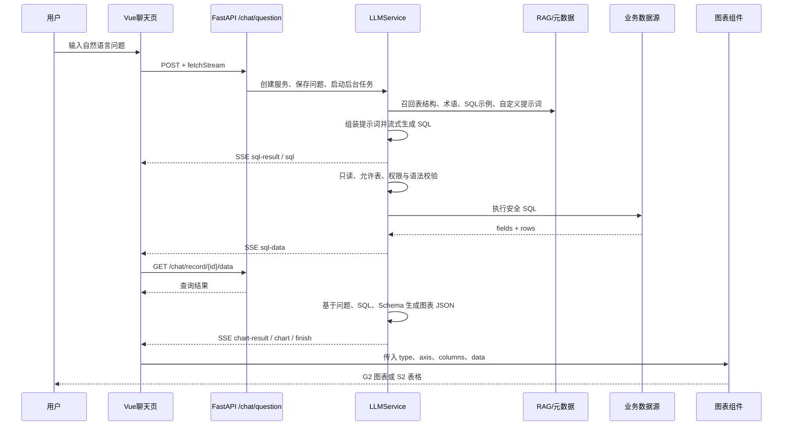

# SQLBot 项目学习总指南

> 面向第一次阅读 SQLBot 的 Python / Vue 开发者。建议先跑通，再沿着本文的“AI 问数主链路”打断点阅读。

## 1. 这是什么项目

SQLBot 是一个 ChatBI（对话式数据分析）系统。用户用自然语言提问，系统把数据库结构、业务术语、历史 SQL 示例等上下文交给大模型，大模型生成只读 SQL；后端校验并执行 SQL，再让大模型生成图表配置，前端使用 AntV G2/S2 渲染图表或表格。

项目的三个核心思想是：

1. **Text-to-SQL**：自然语言转 SQL。
2. **RAG**：只挑选与问题相关的表结构、术语、训练示例和自定义提示词，减少噪声并提高准确率。
3. **受控执行**：生成 SQL 后还要做只读检查、允许表检查、行列权限处理，不能把模型输出直接交给数据库。

## 2. 总体目录

| 目录 | 作用 | 建议先读 |
|---|---|---|
| `backend/` | FastAPI、LangChain、大模型编排、数据库访问、权限与迁移 | `backend/README_TEACHING.md` |
| `frontend/` | Vue 3 + TypeScript，聊天界面、SSE 消费、图表和后台管理 | `frontend/README_TEACHING.md` |
| `g2-ssr/` | 服务端生成图表图片，主要供 MCP/外部集成返回图片 | `g2-ssr/README_TEACHING.md` |
| `installer/` | 安装与部署相关资源 | `installer/README_TEACHING.md` |
| `tests/` | 项目级测试资源 | `tests/README_TEACHING.md` |
| `docs/` | 英文 README 等补充文档 | `docs/README_TEACHING.md` |
| `Dockerfile` | 构建前端、后端、G2 SSR，最后组装 PostgreSQL 一体化镜像 | 本文部署章节 |
| `docker-compose.yaml` | 使用官方镜像启动单容器 SQLBot | 本文部署章节 |

## 3. 最省事的运行方式：Docker

### 3.1 环境要求

- 推荐 Linux x86_64 服务器；Windows/macOS 可使用 Docker Desktop。
- Docker 24+；建议至少 4 核 CPU、8 GB 内存，首次加载向量模型需要更多时间和磁盘。
- 浏览器能访问宿主机的 8000 端口。
- 需要一个可调用的大模型 API；启动后在系统设置中配置，支持 OpenAI 及多家 OpenAI 兼容服务。
- 要问数，还需要一个 SQLBot 支持的数据源账号，建议先使用只读数据库账号。

### 3.2 启动

```bash
docker compose up -d
docker compose logs -f sqlbot
```

访问 `http://localhost:8000/`，默认账号 `admin`，默认密码 `SQLBot@123456`。8001 是 MCP 服务端口。

`docker-compose.yaml` 会挂载 Excel、普通上传文件、MCP 图片、日志和 PostgreSQL 数据目录。生产环境务必修改 `POSTGRES_PASSWORD`、`SECRET_KEY`、`DEFAULT_PWD`，并把 `SERVER_IMAGE_HOST` 改成外部客户端能访问的真实地址。

## 4. 本地开发运行

### 4.1 必备环境

| 软件 | 版本/说明 |
|---|---|
| Python | **3.11.x**，由 `backend/pyproject.toml` 强制指定 |
| uv | 推荐的 Python 依赖与虚拟环境工具 |
| Node.js | 推荐 20 LTS 或 22 LTS |
| npm | 随 Node.js 安装 |
| PostgreSQL | 推荐 15+，并安装 **pgvector** 扩展；数据库名默认 `sqlbot` |
| Git | 获取与管理源码 |

可选：Redis（把 `CACHE_TYPE` 改为 `redis` 时使用）、CUDA 12.8（需要 GPU embedding 时使用）。

SQLBot 的迁移会执行 `CREATE EXTENSION IF NOT EXISTS vector`。本地 PostgreSQL 必须先安装 pgvector，且首次迁移使用的账号要有创建扩展权限；最简单的做法是直接使用带 pgvector 的 PostgreSQL 镜像，或让管理员预先在 `sqlbot` 数据库执行：

```sql
CREATE EXTENSION IF NOT EXISTS vector;
```

### 4.2 配置根目录 `.env`

后端 `common/core/config.py` 从项目根目录 `.env` 读取配置。最小开发配置示例：

```dotenv
PROJECT_NAME=SQLBot
SECRET_KEY=请替换为长随机字符串
DEFAULT_PWD=SQLBot@123456
POSTGRES_SERVER=127.0.0.1
POSTGRES_PORT=5432
POSTGRES_DB=sqlbot
POSTGRES_USER=root
POSTGRES_PASSWORD=你的密码
FRONTEND_HOST=http://localhost:5173
BACKEND_CORS_ORIGINS=http://localhost:5173,http://127.0.0.1:5173
BASE_DIR=C:/tmp/sqlbot
SCRIPT_DIR=C:/tmp/sqlbot/scripts
UPLOAD_DIR=C:/tmp/sqlbot/data/file
EXCEL_PATH=C:/tmp/sqlbot/data/excel
MCP_IMAGE_PATH=C:/tmp/sqlbot/images
LOCAL_MODEL_PATH=C:/tmp/sqlbot/models
LOG_LEVEL=INFO
SQL_DEBUG=false
CACHE_TYPE=memory
EMBEDDING_ENABLED=true
TABLE_EMBEDDING_ENABLED=true
```

Windows 本地运行时要特别改掉默认的 `/opt/sqlbot/...` 路径。若暂时不想下载/加载本地 embedding 模型，可把 `EMBEDDING_ENABLED=false`、`TABLE_EMBEDDING_ENABLED=false`，但 RAG 召回能力会下降。

### 4.3 启动后端

```powershell
cd backend
uv sync --extra cpu
uv run uvicorn main:app --host 0.0.0.0 --port 8000 --reload
```

首次启动时 `main.py` 的 lifespan 会自动执行 Alembic 迁移、初始化缓存、补齐术语/训练样例/表结构向量，并处理模型配置。API 文档地址是 `http://localhost:8000/docs`，接口统一前缀是 `/api/v1`。

如需本地 MCP：

```powershell
cd backend
uv run uvicorn main:mcp_app --host 0.0.0.0 --port 8001 --reload
```

### 4.4 启动前端

确认 `frontend/.env.development` 为：

```dotenv
VITE_API_BASE_URL=http://localhost:8000/api/v1
VITE_APP_TITLE=SQLBot (Development)
```

然后运行：

```powershell
cd frontend
npm install
npm run dev
```

访问 Vite 输出的地址（通常是 `http://localhost:5173`）。`npm run dev` 会先执行 `vue-tsc -b`，类型错误会直接阻止启动。

## 5. 第一次使用的业务配置顺序

1. 登录管理员账号，立刻修改默认密码。
2. 在“模型管理”新增模型：API 地址、API Key、基础模型名、协议；设为默认模型。
3. 创建工作空间并关联模型。
4. 新增数据源，测试连接，同步表和字段。
5. 为表、字段补充业务化中文说明；这是 Text-to-SQL 准确率的关键输入。
6. 按需维护术语库、SQL 训练示例、自定义提示词、表关系和行列权限。
7. 进入问数页，选择数据源后提问。

## 6. AI 问数完整链路



关键代码落点：

- `frontend/src/views/chat/index.vue::sendMessage`：创建前端临时消息并触发回答组件。
- `frontend/src/api/chat.ts::questionApi.add`：调用 `request.fetchStream('/chat/question')`。
- `frontend/src/utils/request.ts::fetchStream`：使用原生 `fetch`，设置 token，并保留可读流。
- `backend/apps/chat/api/chat.py::question_answer_inner`：识别普通提问和“重新生成/分析/预测”快捷命令。
- `backend/apps/chat/api/chat.py::stream_sql`：创建 `LLMService`，保存记录，返回 SSE。
- `backend/apps/chat/task/llm.py::run_task`：核心状态机，串起召回、SQL、执行、图表。
- `backend/apps/datasource/crud/datasource.py::get_table_schema`：取得表字段和关系，并用 embedding 选表。
- `backend/apps/chat/models/chat_model.py::sql_sys_question`：把数据库规则、Schema、样例、术语、训练数据拼成提示词。
- `backend/apps/chat/task/llm.py::generate_sql`：`self.llm.stream(...)` 生成 SQL。
- `backend/apps/db/db.py::exec_sql`：再次执行只读检查，再适配不同数据库驱动执行。
- `backend/apps/chat/task/llm.py::generate_chart`：第二次调用模型生成图表描述 JSON。
- `frontend/src/views/chat/answer/ChartAnswer.vue`：逐块解析 `data:{...}\n\n` SSE；收到 `sql-data` 后拉取数据。
- `frontend/src/views/chat/chat-block/ChartBlock.vue`：解析 `record.chart` 与 `record.data`。
- `DisplayChartBlock.vue -> ChartComponent.vue -> getChartInstance`：整理坐标轴并实例化 Table/Bar/Column/Line/Pie。

### 6.1 后端 SSE 事件协议

| type | 含义 | 前端行为 |
|---|---|---|
| `id` | 新 ChatRecord ID | 回填当前临时消息 |
| `question` | 后端最终保存的问题 | 更新问题文本 |
| `sql-result` | SQL 阶段的推理/流式片段 | 累加到 `sql_answer` |
| `sql` | 校验后的 SQL | 保存并允许用户查看 |
| `sql-data` | SQL 已执行且结果已落库 | GET 数据接口加载 rows |
| `chart-result` | 图表阶段的推理/流式片段 | 累加到 `chart_answer` |
| `chart` | 图表 JSON 字符串 | 交给图表组件解析 |
| `brief` | 会话标题 | 更新左侧会话列表 |
| `error` | 错误信息 | 停止 loading 并展示错误 |
| `finish` | 整条链路结束 | 收尾、允许下一次提问 |

### 6.2 为什么分“数据”和“图表配置”

`chart` 只描述图表类型、标题、列与坐标轴映射；真实查询数据通过 `/chat/record/{id}/data` 单独获取。这样 SSE 不必塞入大量结果行，刷新历史会话时也能按需加载数据，还能对大整数统一做字符串保护。

### 6.3 安全边界

模型不是可信执行者。`run_task` 会用 `sqlglot` 提取 SQL 中真实访问的表，并与当前允许表集合比较；普通用户还会经过行列权限 SQL 改写。最终 `exec_sql` 再调用 `check_sql_read`，拒绝写操作。二次开发时不要删除这些校验，也不要在前端直接执行模型输出。

## 7. 推荐学习路线

1. 跑通 Docker 版，完成“模型 → 数据源 → 问题 → 图表”。
2. 本地启动前后端，在 `question_answer_inner`、`run_task`、`ChartAnswer.vue` 打断点。
3. 手工记录一轮 SSE 的事件顺序，理解流式协议。
4. 修改 `templates/template.yaml` 中一条提示词规则，观察 SQL 输出差异。
5. 为一个表添加中文注释、术语和训练 SQL，比较 RAG 前后的准确率。
6. 新增一种图表类型：后端图表提示词约束 + 前端 `CHART_TYPE_MAP` + 新图表类。
7. 最后再阅读工作空间、权限、嵌入、MCP、仪表板等外围能力。

## 8. 调试与常见问题

- **后端连不上 PostgreSQL**：检查 `.env` 的 host/port/账号；Windows 上的 `localhost` 指本机，容器中的 `localhost` 指容器自己。
- **前端 401**：确认浏览器缓存 token、`VITE_API_BASE_URL` 和后端 CORS；前端流式请求也会单独添加 token。
- **首次启动很慢**：常见原因是 embedding 模型下载或为已有数据生成向量。
- **模型能回答但 SQL 错**：先检查表字段注释、数据库类型模板、表关系与 SQL 示例，不要只改 temperature。
- **图表为空**：依次检查 SSE 是否收到 `sql-data`、数据接口是否有 rows、`chart` JSON 的字段名是否与 rows 的 key 一致。
- **大整数精度丢失**：项目已使用 `json-bigint`，后端也会把超过 JavaScript 安全范围的整数转字符串；新增接口时要沿用该策略。

## 9. 文档导航

- 模块深度导读：`MODULE_DEEP_DIVE.md`（建议在总指南之后立即阅读）
- 后端地图：`backend/README_TEACHING.md`
- AI 问数后端：`backend/apps/chat/AI_ASKING_FLOW.md`
- LLM 核心文件：`backend/apps/chat/task/LLM_SERVICE_TUTORIAL.md`
- 前端聊天链路：`frontend/src/views/chat/CHAT_UI_TUTORIAL.md`
- 每个 backend 子目录下均有 `README_TEACHING.md`，用于贴着代码阅读。
